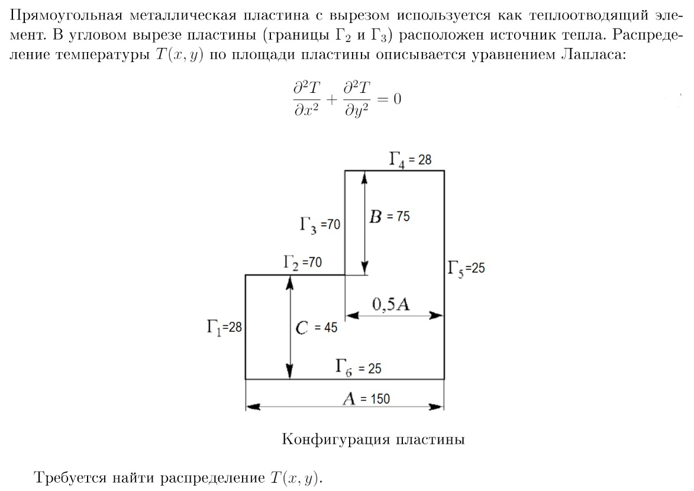

# Курсовая работа по дисциплине "Численные методы" 
### (университет, V семестр, 2021-2022)
Приводятся два метода решения задачи по расчету температурного
поля пластины сложной формы в зависимости от положения источника
тепла: итерационные - метод Зейделя (Seidel), проекционный - 
метод сопряженных градиентов (Conjugate gradient, CG).
Приведено сравнение эффективности методов.
Все подробности в отчете - файл с расширением `.pdf`.

